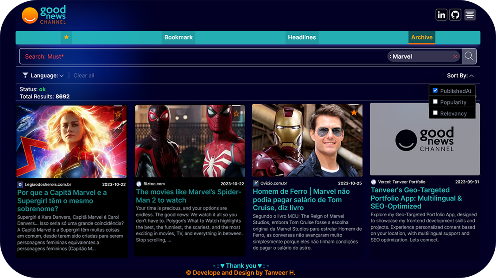

# Tanveer's Good News Progressive Web App: Filters And Bookmark

Welcome to "Good News PWA: Filters & Bookmark," a feature-rich news web application designed and developed by Tanveer H. It provides a seamless news browsing experience, including various filtering options, search functionality, bookmarking, infinite scrolling, and a scroll-to-top feature.

## Features
- **Filtering**: Sort and filter news articles by category, language, and country.
- **Search**: Find articles quickly with the robust search functionality.
- **Bookmark**: Bookmark your favorite articles for easy access later.
- **Infinite Scrolling**: Continuous loading of articles as you scroll down the page.
- **Scroll to Top**: Navigate back to the top of the page with one click.
- **Responsive Design**: Adjusts to accommodate different screen sizes and advertisements.
- **Adjustable UI**: The UI adjusts to accommodate advertisements without compromising the user experience.

## Technologies Used
- [Next.js](https://nextjs.org/): A React framework for building modern web applications.
- [Set Data Structure](https://developer.mozilla.org/en-US/docs/Web/JavaScript/Reference/Global_Objects/Set): Used for storing bookmarks with high performance.
- [useMemo Hook](https://reactjs.org/docs/hooks-reference.html#usememo): In `NewsAppContext.js`, `useMemo` is used to optimize performance by memoizing the context value, preventing unnecessary re-renders and recalculations when dependencies remain.
- [next-pwa](https://github.com/shadowwalker/next-pwa): A plugin for enabling Progressive Web App (PWA) support in Next.js applications.
- [Tailwind CSS](https://tailwindcss.com/): Used for styling and creating a visually appealing user interface.
- [SWR](https://swr.vercel.app/): A library for data fetching, caching, and state management.
- [React Infinite Scroll Component](https://www.npmjs.com/package/react-infinite-scroll-component): A library for implementing infinite scrolling functionality.
- [React Context API](https://reactjs.org/docs/context.html): Used for state management.
- [ESLint](https://eslint.org/) and [SonarLint](https://www.sonarlint.org/): Tools used to maintain code quality and handle errors.

## Technical Highlight
- **Optimization**: Implemented a Set Data structure for performance optimization and improved efficiency.
- **Modularity**: Components and functions are reused multiple times, ensuring a clean and maintainable codebase.
- **Scalability**: Designed with an adjustable UI to accommodate future features and enhancements.

## Getting Started

1. Clone this repository.
2. Install dependencies using `npm install`.
3. Configure environment variables for necessary services, including Google Analytics.
4. Start the development server using `npm run dev`.
5. The app should now be running on [http://localhost:3000](http://localhost:3000).

## Deployment

The app is deployed using Vercel. It is automatically built and deployed upon pushing changes to the main branch. You can visit the live site [here](https://tanveer-goodnews.vercel.app).

## Usage

Feel free to explore the app and learn more about my projects and skills. If you're interested in collaboration or have any questions, use the contact form to get in touch.

## Contact

If you have any questions or feedback about the app, you can reach out to me through my website: [My Portfolio Website](https://tanveer-portfolio.vercel.app/en-US).

---

**Thanks for giving your precious time!**

---